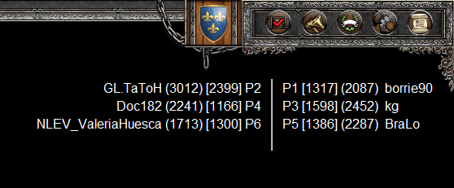
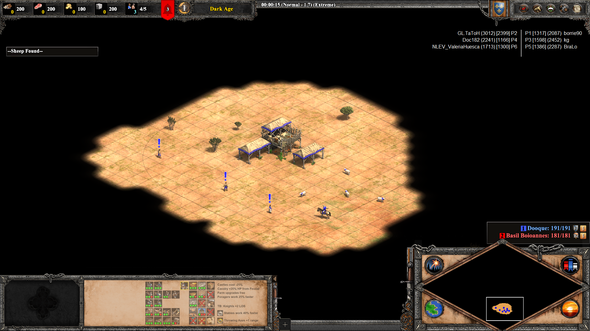
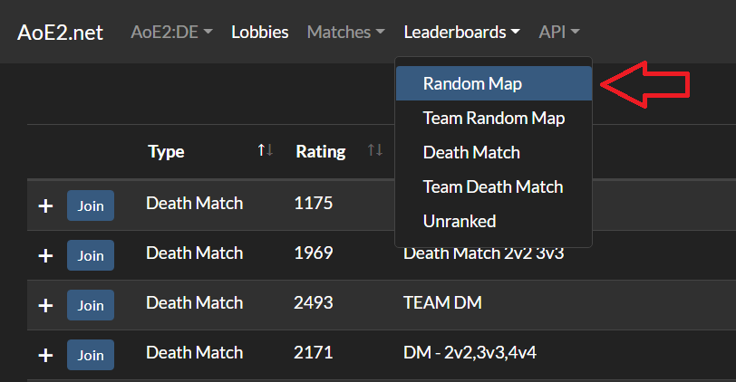
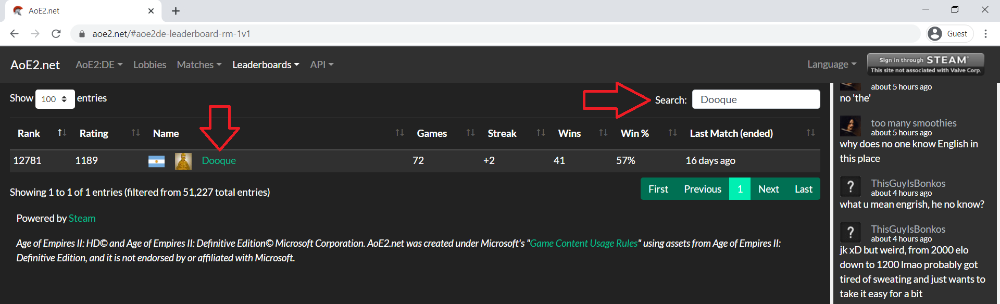
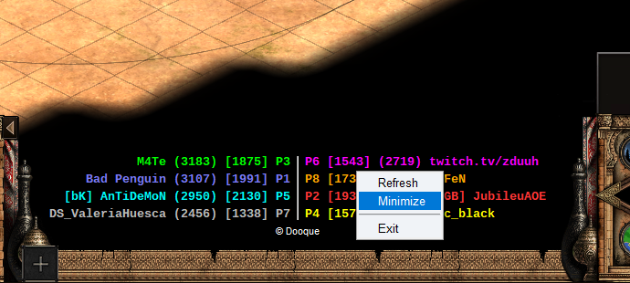
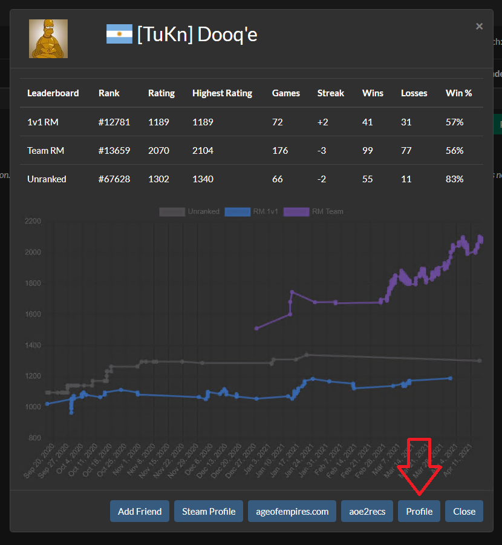

# Age of Empires II DE - In Game Rating Overlay

[English](./README.md) | [Español](./README.es.md)

Join discussion on [Discord](https://discord.gg/5Ke9Fa5G5x)

## Download

You can download the latest release from [here](https://github.com/Dooque/aoe2-de-in-game-rating-overlay/archive/refs/tags/v0.2.1.zip).

## Introduction

This is an in game rating overlay which shows on top of the screen the RM 1v1 ELO and RM TG ELO for all players in a multiplayer game.

It currently works only for "Random Map" games.

You can drag the text anywhere in the in the screen. The program will remember the position in the screen for the next time.

The 1v1 ELO is shown between *[ ]* and the TG ELO is shown between *( )*.

Also it is possible to minimize the window. Right click on the window and click on "Minimize".

The position of the minimized window is independent of the maximized window, so for example, in between games you can put the minimize window in a position where it does not collide with the game's menu.

You can also see extended players information if you let the mouse pointer over the name of a player:

## Installation & Configuration

The program requires no installation. Just extract the ZIP file, configure your profile ID, install the font, and run the `aoe2de-mp-ratings.exe` file.

You can install the font by double clicking on the `LiberationMono-Bold.ttf` file, and then press `Install` button. Once installed you can close the Font window.

The only required configuration you need is to write your [AoE2.net](https://aoe2.net) profile ID into the `AOE2NET_PROFILE_ID.txt` file.

### How to close the program?

Right click and the click on `Exit`.

### How do I get my AoE2.net profile ID?

Go to https://aoe2.net/.

Click on "Leaderboards" and pick "Random Map":

On the search section enter your Steam profile name. Once you see yourself in the table click on your name:

> NOTE: If you don't appear in the list it is because you haven't play at least 10 ranked games. You need to play 10 ranked games to have an AoE2.net profile ID.

Click on the "Profile" button at the bottom right of the window:

Then you will see the profile ID in the URL section:

Copy and paste it into the `AOE2NET_PROFILE_ID.txt` file.

And that's it, you can now run the `aoe2de-mp-ratings.exe` file.

## What's next?

1. Be able to change the text color from configuration file.
2. Be able to set a background with solid color from a configuration file.
3. Show the text with the "self (blue) / ally (yellow) / enemy (red)" color mode.
4. Make it work for Empire Wars.
5. Make it work for Death Match.

## Known Issues

1. After server updates or new game releases the application may fail to connect to the servers. WORKAROUND: So far the problem seems to vanish after about 24 hours.
2. If you have an extra monitor connected to the PC, and you display the application on that screen, and the you disconnect the monitor the application will still be display in the position of the previous screen, so you are not going to see the application. WORKAROUND: Delete the file `C:\Users\USER\aoe2de_in_game_rating_overlay-window_location.txt`.

## CHANGELOG

### v1.0.0

* Replace the usage of aoe2.net profile ID by Steam ID.
* Now the application can manage multiple players profiles.
* Checks and inform about new versions.
* Players' name are now of fixed size so the window size is smaller.
* Updated the extended player information (when the mouse goes over the player name) so it is smaller.
* Fixed an issue with the "Refresh" button.
* Fixed issues related to the match information when it is incomplete in terms of team and color information.
* Fixed an issue where the main window moves some pixels after refreshing.

### v0.2.1

* Fixed an issue where the program crash if the server is not available.
* Fixed an issue where the windows position change when switching between Minimize and Maximize.
* Fixed an issue when clicking on "Refresh" button the data was not being updated until a new game was started.

### v0.2.0

* Changed font size from 11 to 9.
* Changed font type from Britannic Bold to Liberation Mono Bold.
* Added font file to be installed.
* Added loading banner.
* Added menu to close the program.
* Added menu to minimize/maximize the window.
* Added menu to refresh the game information.
* Added extended player information when the mouse goes over the player name.
* Added copyright.

### v0.1.0

* Changed font size from 14 to 11.
* Changed font type from Arial to Britannic Bold.
* Added text color for each player.
* The window remembers the last position on the screen.

### v0.0.1

* Fetch the latest game of the AoE2.net profile ID saved in the `AOE2NET_PROFILE_ID.txt` file.
* Fetch all the players from the latest game.
* Fetch the following information from each player:
  * Random Map 1v1 Rating.
  * Random Map 1v1 number of wins.
  * Random Map 1v1 number of losses.
  * Random Map 1v1 streak.
  * Random Map Team Game Rating.
  * Random Map Team Game number of wins.
  * Random Map Team Game number of losses.
  * Random Map Team Game streak.
* Show some of the information in a transparent window of fixed text font (Arial), size (14) and color. (white).
* The program fetch for a new game every a fixed amount of time (10 seconds).

- - -

*Age of Empires II Definitive Edition © Microsoft Corporation. Age of Empires II DE - In Game Rating Overlay was created under [Microsoft's "Game Content Usage Rules"](https://www.xbox.com/en-US/developers/rules) using assets from Age of Empires II Definitive Edition, and it is not endorsed by or affiliated with Microsoft.*
